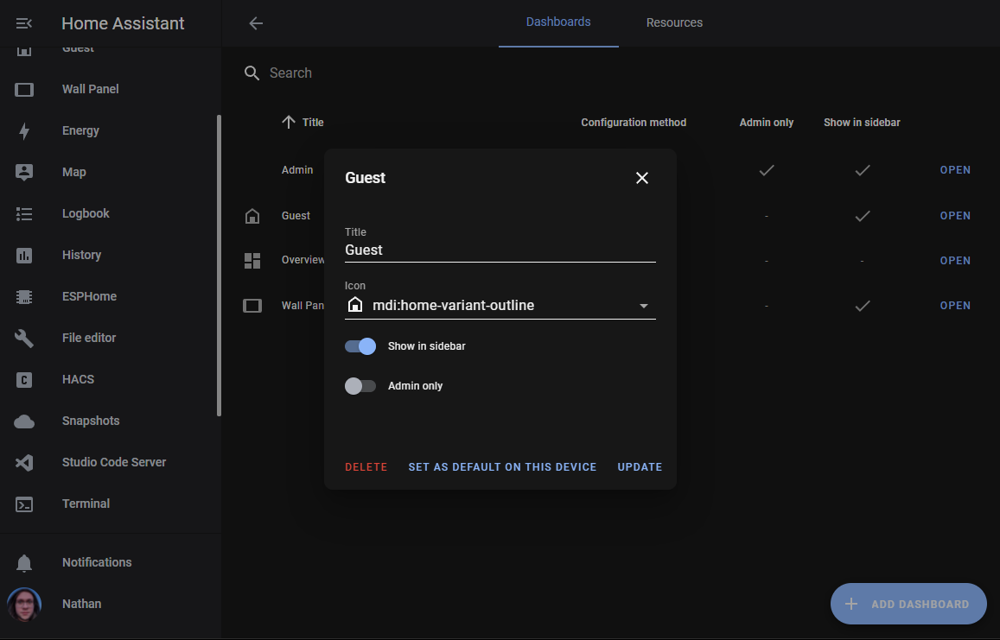
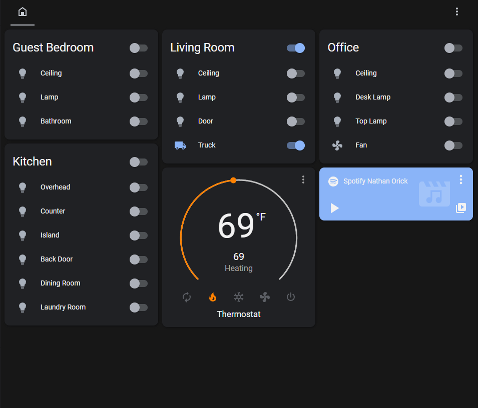

<div class="alert alert-warning">
    <b>Disclaimer:</b>
    Bypassing Home Assistant's authentication is dangerous, and can introduce serious security risks. <a href="#a-note-on-security">More Info</a>
</div>

# Why Guests Hate Home Assistant
I often have family and friends over at my place, and almost every time they ask "How do I turn on the light?" or "What was
the Home Assistant login again?" It's always a pain for them to have to take the time to find the Home Assistant
url and then log in with the guest credentials.

In the past, I've just printed the guest username and password and posted it on the fridge, but now I think
I've finally found a way to help ease the pain (and encourage my guests to use the guest dashboard in HA that I put 
so much work into).

With the setup I'll explain in this post, my guests can now simply scan a QR code and immediately have access to the guest
account on my Home Assistant instance.


# Setup and How it Works
The setup to make this work is pretty straightforward. It only requires a web server sitting somewhere on your local network
and a QR code printed and placed somewhere convenient for your guests.

The whole sign-in process goes like this:
1. The guest scans the QR code
1. The guest is redirected to a welcome page on your local network (hosted on your web server)
1. Javascript running in the browser on that web page will make a request to the web server for a redirect URL
1. The web server uses the guest username and password it has stored locally to start the sign-in process with Home Assistant
1. Home Assistant returns a code to the web server and the web server includes that code in a redirect URL it sends to the guest's browser
1. The guest's browser is redirected to the URL and the code is used to finish authenticating with Home Assistant
1. The guest is now signed in to Home Assistant and redirected to the dashboard


## The Web Server
To host my web server, I just used a Raspberry PI Zero I already had lying around. The server doesn't by any means need to be beefy, so almost anything will work. You could even run it on the same machine that hosts your Home Assistant instance.

## Getting the code
The code for the project can be found on github [here](https://github.com/cnorick/ha-auto-guest-login). To get started, clone the repo onto the machine you plan to use as the web server.

Following is the complete code for the web server. It uses [express](https://expressjs.com/) to handle both the request for the index.html file and the request for the redirect URL.

```javascript
import fetch from "node-fetch"
import express from "express"

// Change these to match your setup
const haUrl = "http://homeassistant.local";
const clientId = "http://homeassistant.local/";
const dashboard = "lovelace-guest";
const guestUserName = "username";
const guestPassword = "password";
const port = 80;


function getState() {
  const state = {
    hassUrl: `${haUrl}`,
    clientId: clientId,
  };
  const jsonState = JSON.stringify(state);
  return Buffer.from(jsonState).toString('base64');
}

async function getFlowId() {
  const response = await fetch(`${haUrl}/auth/login_flow`, {
    headers: {
      accept: "*/*",
      "accept-language": "en",
      "content-type": "text/plain;charset=UTF-8",
    },
    body: `{"client_id":"${clientId}","handler":["homeassistant",null],"redirect_uri":"${haUrl}?auth_callback=1"}`,
    method: "POST",
  });

  return (await response.json()).flow_id;
}

async function getCode() {
  const flowId = await getFlowId();
  const response = await fetch(
    `${haUrl}/auth/login_flow/${flowId}`,
    {
      headers: {
        accept: "*/*",
        "accept-language": "en",
        "content-type": "text/plain;charset=UTF-8",
      },
      body: `{"username":"${guestUserName}","password":"${guestPassword}","client_id":"${clientId}"}`,
      method: "POST",
    }
  );
  return (await response.json()).result;
}

function createRedirectUri(code) {
  let uri = `${haUrl}/${encodeURIComponent(dashboard)}?auth_callback=1`;
  uri.includes("?") ? uri.endsWith("&") || (uri += "&") : (uri += "?");
  uri += `code=${encodeURIComponent(code)}`;
  uri += `&state=${encodeURIComponent(getState())}`;
  uri += "&storeToken=true";
  return uri
}

async function getRedirectUri() {
  var code = await getCode();
  var uri = createRedirectUri(code);
  return uri;
}


const app = express()

app.get('/', (req, res) => {
  res.sendFile("index.html", { root: '.' });
})
app.get('/api/getRedirectUri', async (req, res) => {
  res.send(await getRedirectUri())
})

app.listen(port, () => {
  console.log(`Example app listening at http://localhost:${port}`)
})

```

## Running the Web Server
After you clone the repo, you'll need to install all the dependencies with `npm install`. Also, be sure to replace the variables in `server.js` to point at your Home Assistant instance and use the correct guest account credentials.

Note the `dashboard` variable. You can set this value to point at a dashboard specifically made for your guests. You can
also leave it blank to use the default lovelace dashboard, or include links to specific views within a given dashboard.

Once you've properly set up the project, you can run the server from your current folder with `node .`. You may have to use `sudo` if you're using port 80.

To test the server, you can open a browser from a different machine on your network and go to `http://<webServerIpAddress>:<port>`. For my setup, I was able to set the hostname of the Raspberry PI and use a much more memorable url (`http://welcome.local`).

If everything worked correctly, you should be redirected to the Home Assistant dashboard logged in as your guest user.

# A Note on Security
Like I mentioned in the disclaimer at the top of this post, doing this can open you up to security risks, but for my particular setup, I've decided the risk is acceptable. Here's my thought process.

The downside is pretty obvious. By setting up this server, anyone on your network will be able to log into your Home Assistant instance as your guest user. In my opinion, that is ok for two reasons:
1. Letting anyone on the network log in is exactly the goal of this project. What we're trying to replace here is the need to physically write down the guest credentials on a piece of paper and share it publicly in the house.
2. If (like me) you don't use SSL communication locally with Home Assistant, those usernames and passwords are already being sent over your local network in plain text every time you log in anyway. If someone from the outside world were to get access to your network, they could already find those credentials if they were looking for them -- maybe this actually works better as an argument in favor using SSL instead of a rationalization of breaking secure best practices.

# Bonus Points
After you get the server running, here are some extra pointers for perfecting your setup.

## Use systemd to Keep the Server Running
I actually learned about systemd specifically for this project. It's a great way to manage your server and keep it running. I'll leave it to the reader to research more about systemd, but here is my setup on my Raspberry PI Zero:

The repo is cloned into `/home/pi/welcome_server`. Then I created a file called `/lib/systemd/system/welcome_server.service` with the following contents:
```
[Unit]
Description=Welcome Server
After=network.target
After=network-online.target

[Service]
WorkingDirectory=/home/pi/welcome_server
ExecStart=/usr/bin/node /home/pi/welcome_server
Restart=on-failure
RestartSec=5s

[Install]
WantedBy=multi-user.target
```

With this configuration, the server starts when the Raspberry PI boots up, and restarts if the server crashes.

## Make a Better Guest Experience
### Create a Separate Guest Dashboard
I really wanted to limit what my guests were able to do in Home Assistant. Not just because I didn't want them messing with all my lights, but also because I didn't want them to be overwhelmed with all the options my wife and I have gotten used to over time.

To make this easier, I created a separate dashboard for my guests. I named it `lovelace-guest`. You can do this from `/config/lovelace/dashboards`.



After I created the dashboard, I only added controls for the things I thought my guests would actually need to control and disabled the account's access to all the other much more complicated dashboards and views.




# Conclusion
This setup has worked out really well for me and my guests, and I hope it can make your guests a little happier as well. If you have any questions or suggestions, please leave a comment
in the comments section below.