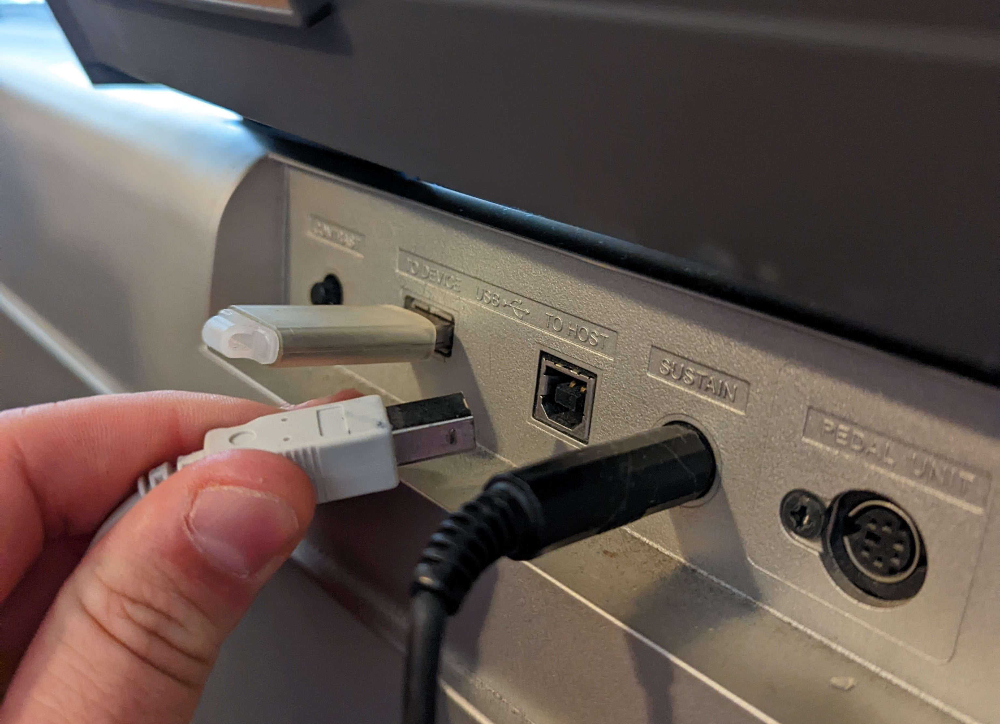
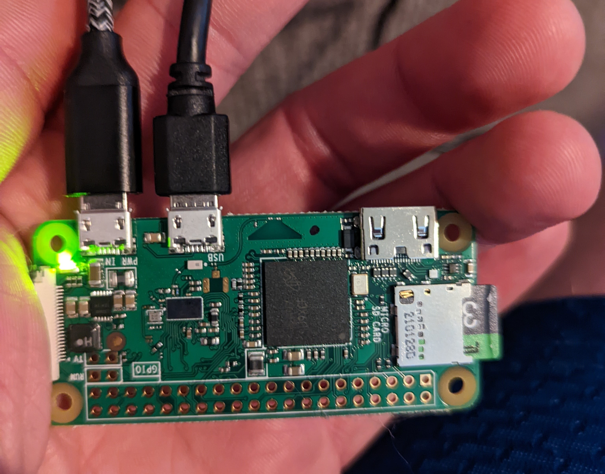
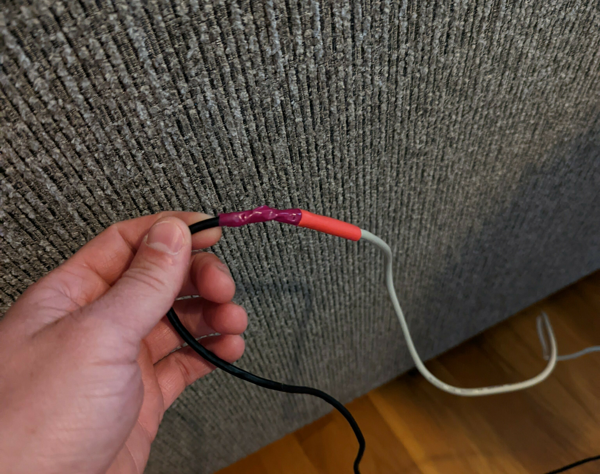
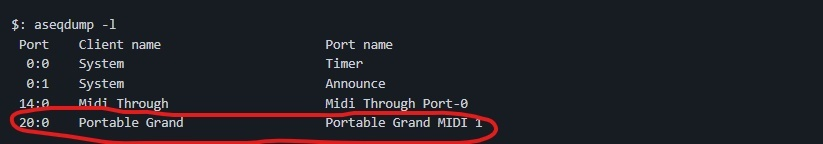
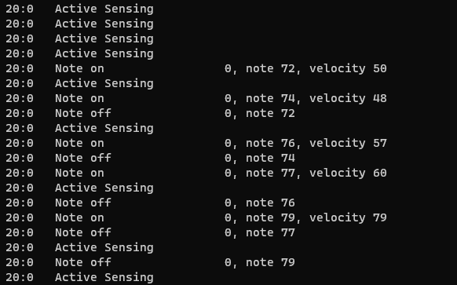

Do you remember that scene from _Willy Wonka and the Chocolate Factory_ where Wonka opens a door with a little organ in the wall? For some reason, that scene popped in my head the other day,
and I couldn't rest until I had my own door-opening organ. With about half a day's work, I created the most impractical way to control your smart home.

## Video of it in Action



In this post, I'll talk about how I got it working and some of the things I learned along the way.

# Hardware
I already had the midi keyboard you see in the video. It's a Yamaha YPG-635. The first thing I did was pulled out the old manual to see how to connect it to a computer, and it turns out it's pretty simple.
It just has a usb-B port in the back.


Next, I decided I'd try to run the server on a Raspberry Pi 0 I had laying around. I didn't imagine I would need a ton of resources to process midi data.


And that brings us to my first bump in the road. I needed a micro-usb to usb-B cord. Turns out those are tough to come by, and I certainly didn't have any in the house, so it was time to pull out the soldering iron.
I found out it's actually pretty easy to splice usb cables. The usb-B adapter has 4 pins, and the micro-A adapter has 5. I just had to match up the colors and leave out the unused wire.


# Discovering Midi Devices on Linux
After a long time not being able to find my keyboard listed under `/dev` on the rpi, I resorted to testing each pin
on the usb cable with my multimeter. They were all ok! Then, to my surprise, when I plugged the keyboard back in to the rpi, the device finally showed up in `/dev`. Who knows why?

Not only did it show up as a usb device, but Linux had also done the work of registering it as a midi device too. At that point, I was able to use one of the built-in sound tools to get
some information about my device. I ran `aseqdump -l` and saw my piano listed in the output on port 20:


After getting the port number, I ran `aseqdump --port=20`. I had data! It printed to the console every note I played:


Now, just to write some code...

# The Code
I did some digging to see if there were some libraries already out there to use. There wasn't anything that did exactly what I needed, but I did find a python library with an api for
interacting with midi data, [rtmidi-python](https://github.com/superquadratic/rtmidi-python). It allows you to poll for midi devices, then connect to the one you want. Then you
can use simple apis for determining the note that was played, how hard it was played, and other cool information.

## MidiSubscriber
I needed a way to track the notes as they were being played so that I could trigger Home Assistant routines when a certain sequence is played. I ended up creating a super small python
module to simplify that process. You can see all of that code at [MidiSubscriber](https://github.com/cnorick/py-midi-subscriber).

Basically, it lets you specify sequences of notes or chords that you want to monitor, then executes a callback function when the sequence or chord is played.

## Glueing it together with HA
All I was left with now was to write some code to trigger a Home Assistant automation when MidiSubscriber recognized specific notes. Here's that code:

```py
import http.client
from midiSubscriber import MidiSubscriber

WEBHOOK_ID = "<redacted>"
PIANO_NAME = "Portable Grand"

def callWebhook(id):
    conn = http.client.HTTPConnection("homeassistant.local")
    conn.request("POST", "/api/webhook/" + WEBHOOK_ID + "?id=" + id)

wonkaSeq = ['D3', 'C#3', 'D3', 'C#3', 'D3', 'D3', 'C#3', 'D3', 'E3', 'F#3', 'E3', 'F#3', 'G3', 'A3', 'G#3', 'A3', 'G#3', 'A3']
furElise = ['E4', 'D#4', 'E4', 'D#4', 'E4', 'B3', 'D4', 'C4', 'A3', 'A1', 'E2', 'A2', 'C3', 'E3', 'A3', 'B3', 'E1', 'E2', 'G#2', 'E3', 'G#3', 'B3', 'C4', 'A1', 'E2', 'A2', 'E3', 'E4', 'D#4', 'E4', 'D#4', 'E4', 'B3', 'D4',
 'C4', 'A1', 'A3', 'E2', 'A2', 'C3', 'E3', 'A3', 'B3', 'E1', 'E2', 'G#2', 'E3', 'C4', 'B3', 'A1', 'A3', 'E2', 'A2']
nbc = ['G3', 'E4', 'C4']

midi = MidiSubscriber(PIANO_NAME)

midi.registerChord(['C3', 'E3', 'G3'], lambda: callWebhook("c-chord"))
midi.registerChord(['F3', 'A3', 'C3'], lambda: callWebhook("f-chord"))
midi.registerChord(['D3', 'G3', 'B3'], lambda: callWebhook("g-chord"))
midi.registerChord(['C3', 'A3', 'E3'], lambda: callWebhook("am-chord"))
midi.registerChord(['E3', 'G3', 'C4'], lambda: callWebhook("cfirst-chord"))
midi.registerSequence(['E4', 'G4', 'C5'], lambda: callWebhook("seq-egc"))
midi.registerSequence(['C5', 'G4', 'E4'], lambda: callWebhook("seq-cge"))
midi.registerSequence(['E4', 'C5', 'G4'], lambda: callWebhook("seq-ecg"))
midi.registerSequence(wonkaSeq, lambda: callWebhook("wonka"))
midi.registerSequence(nbc, lambda: callWebhook("nbc"))
midi.registerSequence(furElise, lambda: callWebhook("furElise"))
#midi.printSequence()
midi.run()
```

All this does is defines a few note sequences and chords, then posts an id to a Home Assistant webhook trigger when
those notes are played.

In Home Assistant, I made a single automation that runs different actions based on what id gets posted to the webhook.

# Making it Reliable
As I was wrapping up the project, I really wanted to make it reliable so it would work when I turned my keyboard off and back on again, so I
got to spend some time learning more about Linux.

In a old post (), I talked about using systemd to
start a linux service on boot, but that wouldn't quite work here. I needed to start the service when the keyboard was turned on (or plugged in to the rpi), and
stop it again when the keyboard was turned off.

After some research, I learned that I could achieve that with a combination of systemd and a [udev rule](https://wiki.archlinux.org/title/Udev).

For completeness, following is my systemd unit and udev rule:

```
[Unit]
Description=Midi Smart Home Control
After=network.target
After=network-online.target
StopWhenUnneeded=yes

[Service]
WorkingDirectory=/home/pi/midi
ExecStart=/usr/bin/python /home/pi/midi/midiToHA.py
Restart=on-failure
RestartSec=5s
```
<br/>

```
ACTION=="add", SUBSYSTEM=="sound", ATTRS{idVendor}=="0499", ENV{SYSTEMD_WANTS}+="midi_smart.service"
```

# Conclusion
While this idea certainly started as a joke, in the end, I picked up some pretty neat knowledge about usb cables, midi devices, and Linux.

I'm always looking to include more ridiculous smart home additions. If you have any other ideas about automations that could be triggered from the
piano, drop me a line in the comments below.
